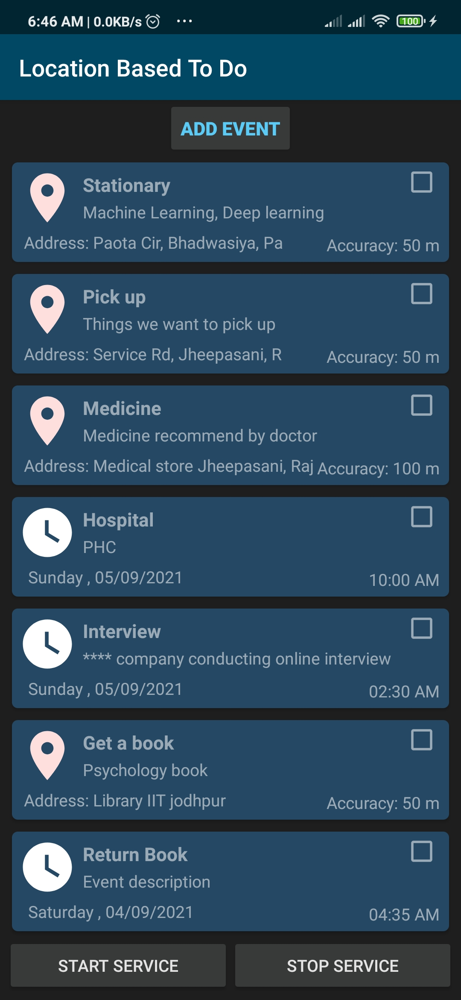
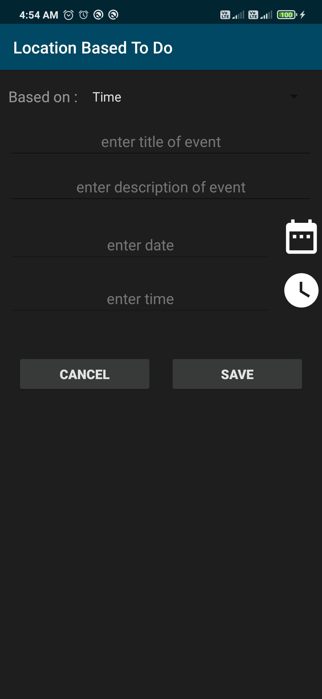
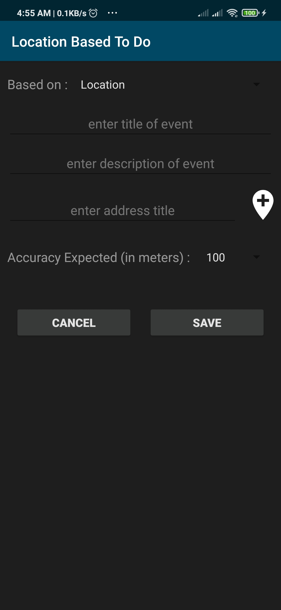
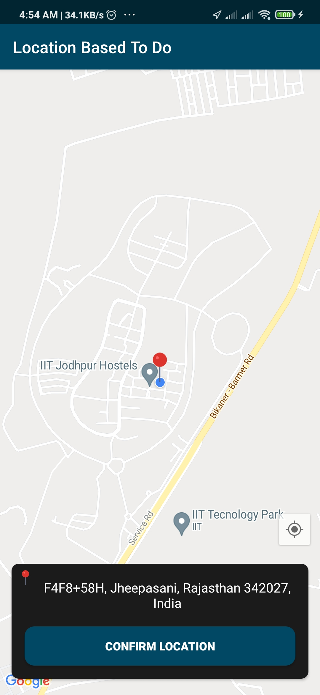
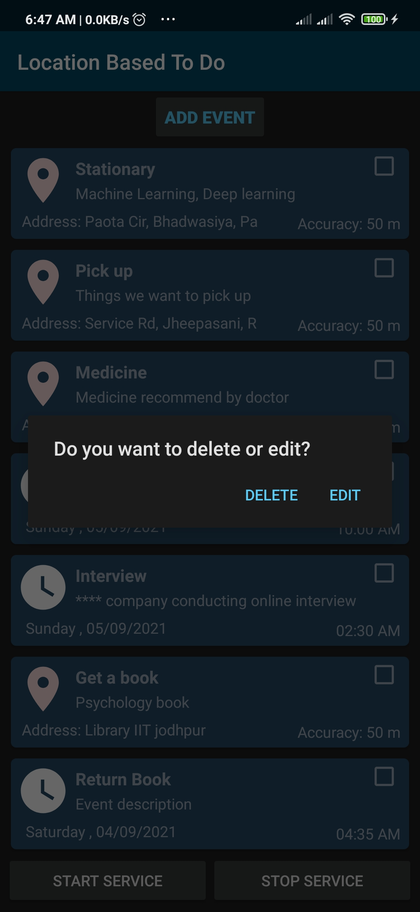
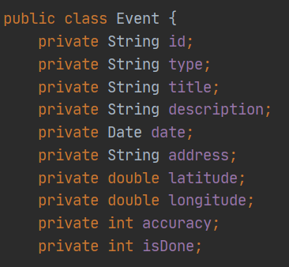

# ToDo_Location_Based

This is an android application that reminds whenever we are close to a due location.

# Motivation:
Many people forgot or miss the important places. Like In a route there are two or three important places for you for some reason like you have to do something over there. Many time people missed that place, As they may concentrated to driving totally or many people have kind of short memory loss. This will help them all to get rid of that problem.

# Technology Used
  java

# Working Demo

 
<b>Home Page</b>

     
     

 
<b>Add new event(time based)</b>

     
     

 
<b>Add new event(location based)</b>

     
     

 
<b>Location selection on Map</b>

     
     

 
<b>Edit or Delete of an event</b>

     
     

# Database

 
<b>Event Table</b>

     
     

# Class Diagrams

 
<b>Event Class</b>

     
     

# Progress direction

    • Implementation of time based To Do
    • Location status Listener
    • Search Bar in location picker
